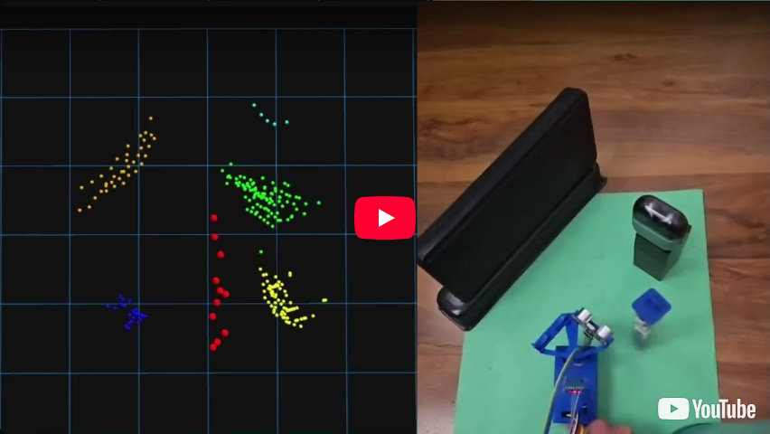
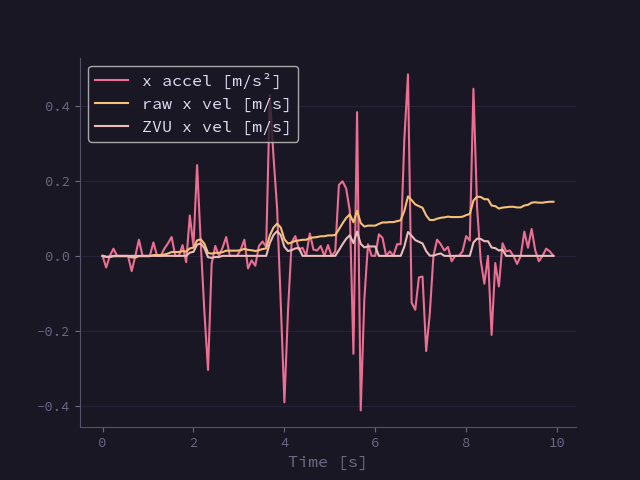
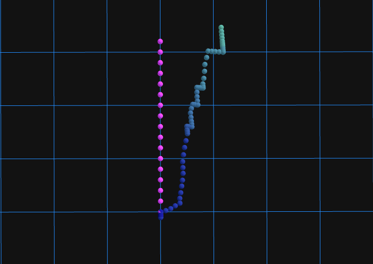
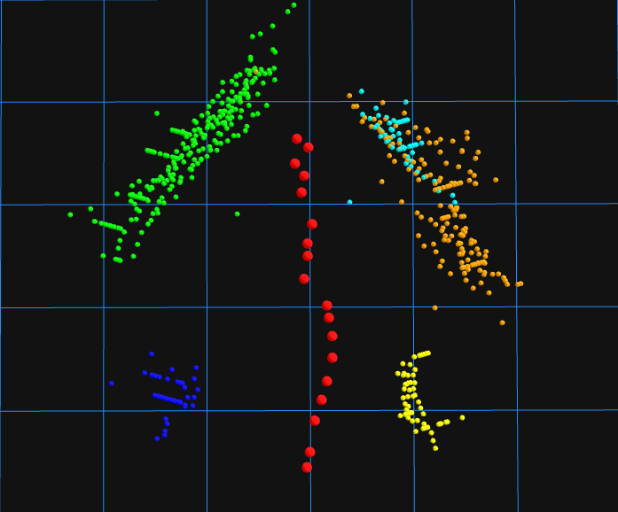
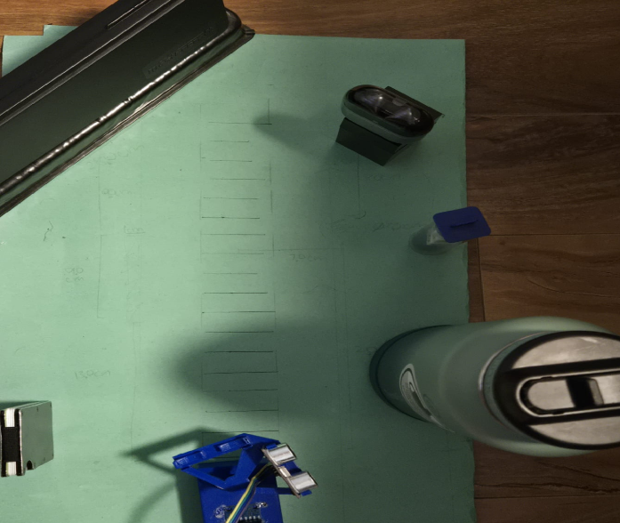

# Sonar-SLAM
A lightweight learning project that implements basic SLAM (Simultaneous Localization and Mapping) using sonar measurements and a 6-axis IMU. The goal was to explore I²C, sensor drivers, sensor fusion, motion estimation, and simple mapping techniques from the ground up.

## Demo
[](https://youtu.be/80hdBnQos3M)

## Table of Contents

- [Motivation](#motivation)
- [SLAM Pipeline and Data Processing](#slam-pipeline-and-data-processing)
  - [Sensors and Drivers](#sensors-and-drivers)
  - [Ultrasonic Data Filtering](#ultrasonic-data-filtering)
  - [Orientation Estimation](#orientation-estimation)
- [SLAM Implementation](#slam-implementation)
  - [Motion Update](#motion-update)
  - [Scan Processing and Landmarking](#scan-processing-and-landmarking)
  - [Weighting and Resampling](#weighting-and-resampling)
- [Takeaways](#takeaways)
- [References](#references)
- [Usage](#usage)
  - [Prerequisites](#prerequisites)
  - [Building and Running](#building-and-running)
- [Hardware](#hardware)
  - [Building the device](#building-the-device)
  - [Wiring](#wiring)


## Motivation
The motivation for this project stems from three primary goals:

1. Educational exploration of robotics concepts:

    This project serves as a platform to study the fundamentals of filtering, sensor fusion, motion estimation, and SLAM algorithms in a hardware-constrained environment.

2. Creating a sensor-agnostic SLAM system:

    The project aims to perform localization and mapping without relying on vehicle-specific internal data such as wheel speeds or odometry. A sensor-independent design makes it easier to retrofit existing vehicles with basic autonomous capabilities.

3. Learning about I²C and sensor drivers:

    To deepen my understanding of hardware interfacing, I implemented the drivers for the stepper motor and the 6-axis motion tracking device myself. This hands-on approach allowed me to gain practical experience with low-level sensor programming.


## SLAM Pipeline and Data Processing

### Sensors and Drivers
This project uses two ultrasonic sensors mounted on a stepper motor to emulate a low-cost 2D lidar. A 6-axis MPU6050 IMU provides acceleration and angular velocity data for motion estimation and basic sensor fusion.

All sensor and motor drivers were implemented manually to gain experience with hardware-oriented programming.

- The stepper motor operates using a half-step sequence, giving 512 steps per full rotation for precise and repeatable scanning.

- The MPU6050 communicates over I²C. The driver was based on Martijn's original Python library, with custom improvements to support calibration routines, filtered data access, and integration into the SLAM pipeline.

### Ultrasonic Data Filtering
To reduce missed or invalid readings and improve measurement accuracy, outliers were removed using an interquartile range (IQR) filter applied over a sliding window of samples. After removing these outliers, the average of the remaining samples was taken to achieve accuracy within approximately 1 cm of the true value.

### Orientation Estimation
The MPU6050 outputs linear acceleration and angular velocity. The first step is estimating the sensor’s orientation so gravity can be removed. Once the gravity vector is isolated, the remaining acceleration can be expressed in the local inertial frame, improving integration and motion estimation.

There are three common ways to estimate orientation: a Madgwick filter, a complementary filter, and a Kalman filter. A complementary filter was chosen because Madgwick performs best with a full 9-axis IMU, and a Kalman filter is far more computationally expensive. This method blends the gyro-integrated and gravity-based roll and pitch using a weighted average. It is computationally cheap and produced about 97 percent accuracy. The main limitation is yaw, since gravity provides no reference on that axis.

Yaw estimation used only the gyroscope’s angular velocity, which contained noise causing integration drift. To address this, a Exponential Moving Average (EMA) filter was used along with a Zero-Velocity Update(ZVU), which zeros the angular rate when multiple consecutive readings fall below a defined threshold.

Stationary Values (Angular Velocity and Yaw Graphs):

| Stationary Velocity | Stationary Yaw |
|:------------------:|:--------------:|
|  |  |

**Note:** The ZVU is responsible for zeroing out noise during stationary periods, as shown above.

To evaluate the impact of filtering, the device was aligned to a paper template at multiple angles.

| Multiple Angle Velocity | Multiple Angle Yaw |
|:----------------------:|:-----------------:|
|  |  |

**Note:** The EMA filter works to reduce extreme values as shown in the left graph above, and the ZVU eliminates drift as shown in the right graph above.

To evaluate accuracy, the device was rotated through three angles (30°, 60°, 90°) and then returned to 0° in reverse order to assess performance over time.

| Multiple Angle Velocity | Multiple Angle Yaw |
|:----------------------:|:-----------------:|
|  |  |

**Note:** After testing, the device maintained a consistent reading within one degree at each angle as shown in the top right graph.

### Pose Estimation

#### Pose Estimation from IMU data

For pose estimation, a similar approach to orientation estimation was used. A static deadzone removed low-level acceleration noise, followed by a Zero-Velocity Update (ZVU) that set velocity to zero when acceleration remained below a threshold for several consecutive cycles. 

| Filtered X Velocity |
|:----------------------:|
|  |
**Note:** After testing, repeated forward motion followed by stationary periods shows how the ZVU prevents drift.

It should also be noted that this filter was tuned more aggressively for repeated start-and-stop motion, as the improvised lidar requires a significant amount of time to complete each scan.

Once this is applied to the X and Y axis as for our scenario we aren't covering the Z axis we can estimate a rough pose of the robot

Here is a test of the pose:
| Pose estimation |
|:----------------------:|
|  |
**Note:** The pink dots represent the ground-truth path, while the blue dots show the estimated pose over time. Lighter points indicate progression along the path.

This result highlights the significant drift that accumulates when relying solely on IMU data, demonstrating that an IMU alone is insufficient for long-term pose estimation.

### SLAM Implementation

Since the IMU alone does not provide reliable long-term pose estimation, a FastSLAM-based approach was used, as it is more robust to noisy motion estimates. This implementation is inspired by *FastSLAM: A Factored Solution to the Simultaneous Localization and Mapping Problem* [1].

The algorithm follows a principle similar to evolutionary methods. For each motion update and sensor scan, \(N\) particles are generated, each with Gaussian noise added to its pose. After the scan is segmented into landmarks, each particle updates its own map and is assigned a weight based on observation likelihood. The particle with the highest weight is then selected as the best estimate.


#### Motion Update

At each pose update, all particles are propagated using the estimated motion, with Gaussian noise added to each particle’s pose. This injected variation helps mitigate drift from noisy sensor readings by allowing particles to explore multiple plausible trajectories. Particles are later evaluated and ranked based on their likelihood.

#### Scan Processing and Landmarking

For each scan, measurement points are segmented into clusters by evaluating the distance between each point and the cluster centroid. By tuning the clustering threshold, distinct landmarks can be extracted from the scan.

These clusters are then passed to each particle, which updates its own map. If a cluster can be associated with an existing landmark, the landmark state is updated using an Extended Kalman Filter (EKF). Otherwise, a new landmark is initialized and added to the particle’s map.

For an associated landmark, the EKF update follows:

Prediction:  
`ẑ = h(x, m)`

Innovation:  
`y = z − ẑ`

Innovation covariance:  
`S = H · P · Hᵀ + R`

Kalman gain:  
`K = P · Hᵀ · S⁻¹`

State update:  
`m = m + K · y`

Covariance update:  
`P = (I − K · H) · P`

where `z` is the observed landmark measurement, `m` is the landmark state, `P` is the landmark covariance, `H` is the measurement Jacobian, and `R` is the measurement noise covariance.

---

#### Weighting and Resampling

Each particle is assigned a weight based on how well its predicted observations match the actual sensor measurements. The likelihood is computed using a multivariate Gaussian:

`w_i ∝ exp(-0.5 · yᵀ · S⁻¹ · y)`

where `y` is the innovation and `S` is the innovation covariance from the EKF update. All particle weights are normalized such that:

`Σ w_i = 1`

To determine whether resampling is required, the effective sample size is computed as:

`N_eff = 1 / Σ w_i²`

If `N_eff` falls below half the total number of particles, resampling is performed. Particles with higher weights are duplicated, while particles with very low weights are discarded. This focuses computational effort on the most likely hypotheses and improves future predictions.

| FastSLAM Output | Ground Truth |
|:----------------------:|:-----------------:|
|  |  |


## Takeaways
After implementing FastSLAM in this way, I was able to achieve approximately 78% accuracy in both mapping and localization. Despite using a relatively noisy sensor setup, the system was able to build a coherent map and maintain a reasonable pose estimate over short to medium time horizons.

The biggest challenge was pose drift, primarily caused by IMU noise, bias, and mechanical disturbances during motion. These errors accumulated over time and propagated into the map, making recovery difficult without loop closure or global optimization. The system also struggled with smaller objects due to sparse sonar scans, and data association proved particularly sensitive, where small tuning changes could significantly impact map stability. Additionally, maintaining an EKF for each landmark in every particle does not scale well beyond small environments.

There are several clear areas for improvement. Replacing the sonar with a LiDAR and using a 9-axis IMU would significantly improve performance. The added magnetometer would allow for more accurate yaw estimation, while denser and faster scans would improve landmark detection, data association, and overall map quality.

## References

[1] Montemerlo, M., Thrun, S., Koller, D., & Wegbreit, B. (2002). *FastSLAM: A Factored Solution to the Simultaneous Localization and Mapping Problem*. Proceedings of AAAI-02.  
https://ai.stanford.edu/~koller/Papers/Montemerlo+al:AAAI02.pdf

## Usage 

### Prerequisites
- Linux-based system (preferably a Raspberry Pi)
- Docker ([Installation Guide](https://docs.docker.com/engine/install/))
- Required hardware (see Hardware section below)

### Building and Running
1. Give the project script execute permissions
```bash
chmod +x script_name.sh
```
2. Enable I²C and set the MPU address
```bash
./slam setup_I²C
```
- **Verify that the MPU6050 is detected.**
- If it is at a different address than 0x68, set the environment variable:
```bash
export MPU_BUS_ADR=<mpu address>
```
3. Build the docker container
```bash
./slam docker_build
```
4. Build the project
```bash
./slam build
```
5. Run the SLAM project
```bash
./slam run
```

## Hardware
### Prerequisites
- Linux-based system (preferably a Raspberry Pi)
- MPU6050
- 2 HC-SR04 Ultrasonic Sensors
- A 28BYJ-48 Stepper Motor with ULN2003 Driver 
- Access to a 3D Printer

### Building the device
Print all the files in the `assets/3d_models` folder.
I used all default printer settings:
- Layer height: 0.2 mm
- Infill: 20%
- Print speed: 100%
- Nozzle temperature: 210 °C
- Bed temperature: 60 °C
- Supports: None (aside from the ultrasonic sensor holder, I used tree supports)
- Filament type: PLA +
- Orientation: 
    - Place the side with the largest surface area against the print bed to minimize supports and reduce print failures.
    - For the ultrasonic sensor holder, printing upright with a brim and supports gives the best results.

1. Attach the ultrasonic sensors to the holder, which should clip into place.<br>

2. Add the motor and driver to the holder.<br>

3. Add the bumper to the slot on the cover with the knobs facing the flat side<br>

4. Add the MPU to the top and apply a small amount of glue to hold it securely for accurate measurements<br>

5. Connect all wires as shown in the next section. Attach the cover to the base and securely connect the ultrasonic sensor holder to the motor.
**Note: If the legs of the cover are too tight you can cut them off if needed.**<br>


### Wiring
You can see the following wiring guide using this [link as well](https://app.cirkitdesigner.com/project/ab884987-0f76-4da1-bcf8-b0c681a3bbe7)

**Note: For the ultrasonic sensors refer to the picture above, the one on the left in the picture above has its trig pin connected to GPIO 26 and echo pin to GPIO 19**


