# Sonar-SLAM
A lightweight learning project that implements basic SLAM (Simultaneous Localization and Mapping) using sonar measurements and a 6-axis IMU. The goal was to explore I²C, sensor drivers, sensor fusion, motion estimation, and simple mapping techniques from the ground up.

## Motivation
The motivation for this project stems from three primary goals:

1. Learning about I²C and sensor drivers:

    To deepen my understanding of hardware interfacing, I implemented the drivers for the stepper motor and the 6-axis motion tracking device myself. This hands-on approach allowed me to gain practical experience with low-level sensor programming.

2. Creating a sensor-agnostic SLAM system:

    The project aims to perform localization and mapping without relying on vehicle-specific internal data such as wheel speeds or odometry. A sensor-independent design makes it easier to retrofit existing vehicles with basic autonomous capabilities.

3. Educational exploration of robotics concepts:

    This project serves as a platform to study the fundamentals of filtering, sensor fusion, motion estimation, and SLAM algorithms in a hardware-constrained environment.

## Usage 

### Prerequisites
- Linux-based system (preferably a Raspberry Pi)
- Docker ([Installation Guide](https://docs.docker.com/engine/install/))
- Required hardware (see Hardware section below)

### Building and Running
1. Give the project script execute permissions
```bash
chmod +x script_name.sh
```
2. Enable I²C and set the MPU address
```bash
./slam setup_I²C
```
- **Verify that the MPU6050 is detected.**
- If it is at a different address than 0x68, set the environment variable:
```bash
export MPU_BUS_ADR=<mpu address>
```
3. Build the docker container
```bash
./slam docker_build
```
4. Build the project
```bash
./slam build
```
5. Run the SLAM project
```bash
./slam run
```

## Hardware
### Prerequisites
- Linux-based system (preferably a Raspberry Pi)
- MPU6050
- 2 HC-SR04 Ultrasonic Sensors
- A 28BYJ-48 Stepper Motor with ULN2003 Driver 
- Access to a 3D Printer

### Building the device
Print all the files in the `assets/3d_models` folder.
I used all default printer settings:
- Layer height: 0.2 mm
- Infill: 20%
- Print speed: 100%
- Nozzle temperature: 210 °C
- Bed temperature: 60 °C
- Supports: None (aside from the ultrasonic sensor holder, I used tree supports)
- Filament type: PLA +
- Orientation: 
    - Place the side with the largest surface area against the print bed to minimize supports and reduce print failures.
    - For the ultrasonic sensor holder, printing upright with a brim and supports gives the best results.

1. Attach the ultrasonic sensors to the holder, which should clip into place.<br>
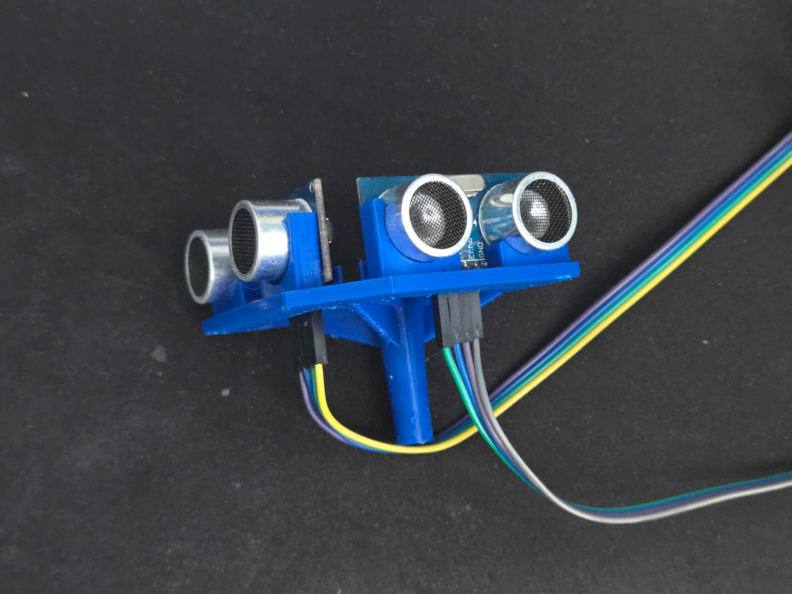
2. Add the motor and driver to the holder.<br>
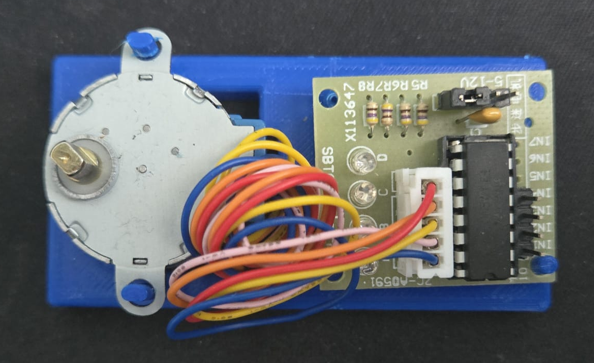
3. Add the bumper to the slot on the cover with the knobs facing the flat side<br>
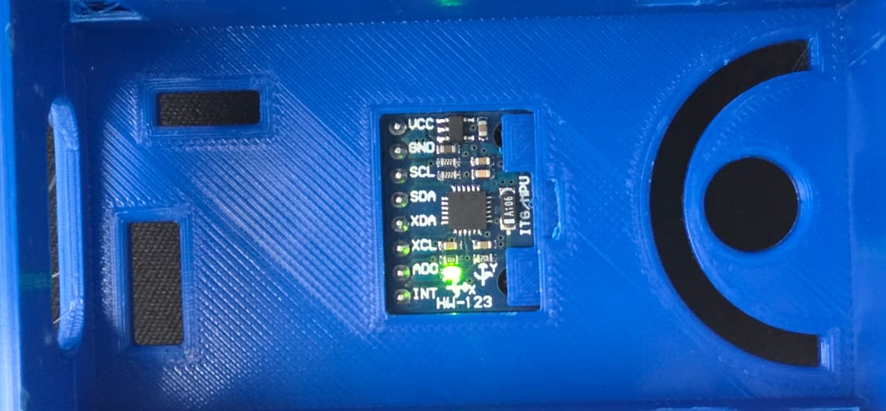
4. Add the MPU to the top and apply a small amount of glue to hold it securely for accurate measurements<br>
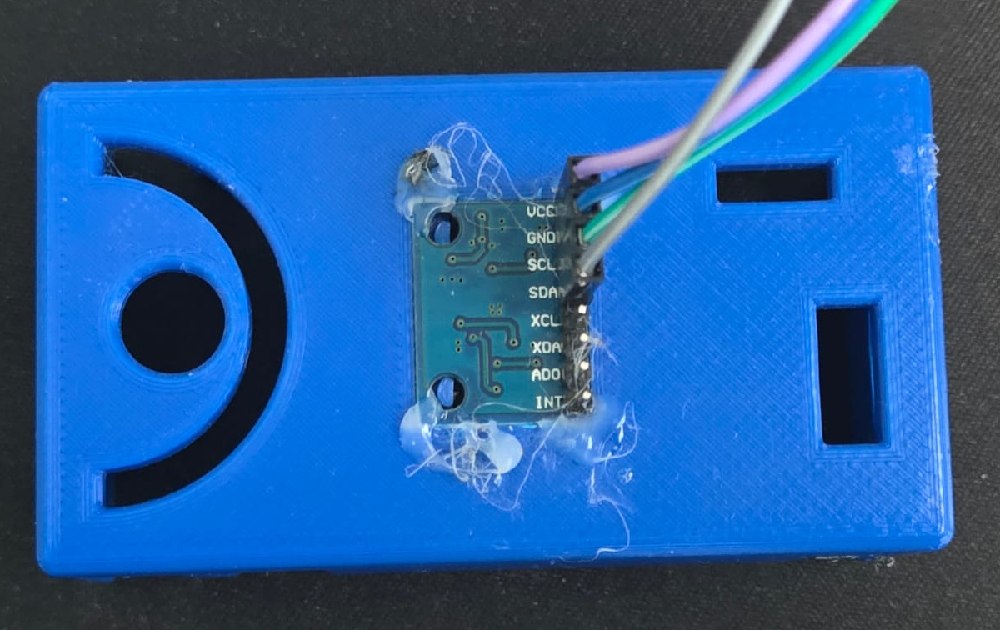
5. Connect all wires as shown in the next section. Attach the cover to the base and securely connect the ultrasonic sensor holder to the motor.
**Note: If the legs of the cover are t0o tight you can cut them off if needed.**<br>
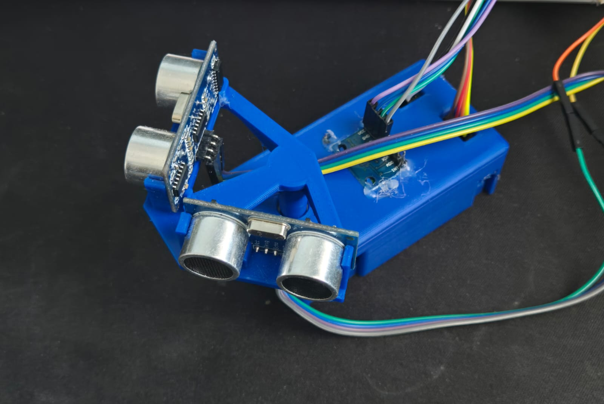

### Wiring
You can see the following wiring guide using this [link as well](https://app.cirkitdesigner.com/project/ab884587-0f76-4da1-bcf8-b0c681a3bbe7)

**Note: For the ultrasonic sensors refer to the picture above, the one on the left in the picture above has its trig pin connected to GPIO 26 and echo pin to GPIO 19**

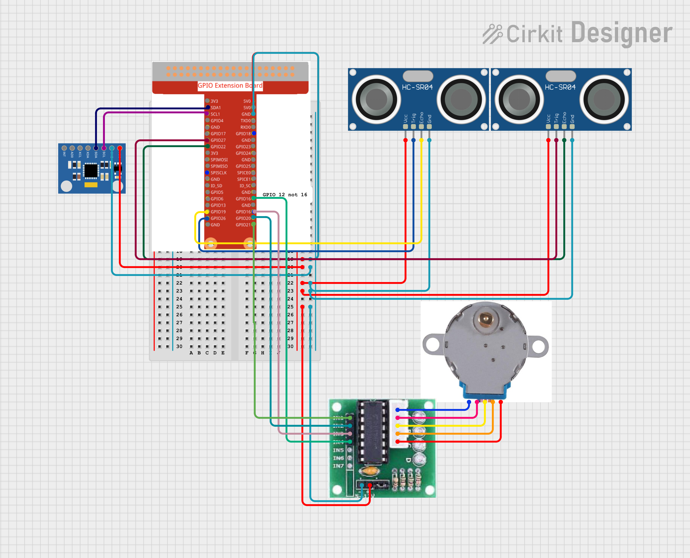

## SLAM Pipeline and Data Processing

### Sensors and Drivers
This project uses two ultrasonic sensors mounted on a stepper motor to emulate a low-cost 2D lidar. A 6-axis MPU6050 IMU provides acceleration and angular velocity data for motion estimation and basic sensor fusion.

All sensor and motor drivers were implemented manually to gain experience with hardware-oriented programming.

- The stepper motor operates using a half-step sequence, giving 512 steps per full rotation for precise and repeatable scanning.

- The MPU6050 communicates over I²C. The driver was based on Martijn's original Python library, with custom improvements to support calibration routines, filtered data access, and integration into the SLAM pipeline.

### Ultrasonic Data Filtering
To reduce missed or invalid readings and improve measurement accuracy, outliers were removed using an interquartile range (IQR) filter applied over a sliding window of samples. After removing these outliers, a mean filter was applied to achieve accuracy within approximately 1 cm of the true value.

### Orientation Estimation
The MPU6050 outputs linear acceleration and angular velocity. The first step is estimating the sensor’s orientation so gravity can be removed. Once the gravity vector is isolated, the remaining acceleration can be expressed in the local inertial frame, improving integration and motion estimation.

There are three common ways to estimate orientation: a Madgwick filter, a complementary filter, and a Kalman filter. A complementary filter was chosen because Madgwick performs best with a full 9-axis IMU, and a Kalman filter is far more computationally expensive. This method produced roll and pitch estimates with roughly 90% accuracy, though it cannot recover yaw.

Yaw estimation used only the gyroscope’s angular velocity, which contained noise causing integration drift. To address this, a median-based EMA filter was used along with a Zero-Velocity Update (ZVU), which zeros the angular rate when multiple consecutive readings fall below a defined threshold.

Stationary Values(Angular velocity and yaw graphs):

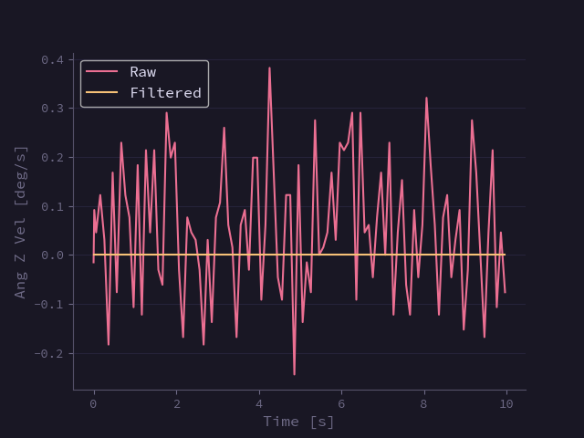
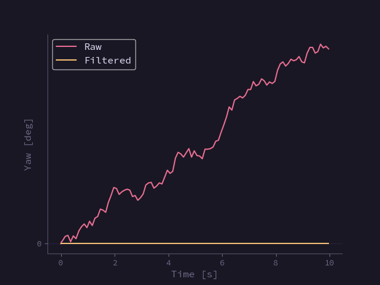

 **Note:** The ZVU is responsible for zeroing out noise during stationary periods, as shown above.

To evaluate the impact of filtering, the device was aligned to a paper template at multiple angles.

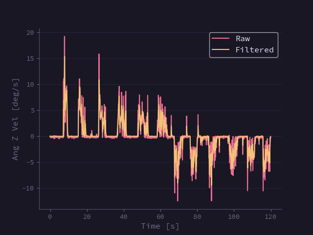
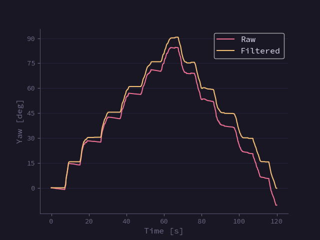

 **Note:** The EMA filter works to reduce extreme values as shown in the left graph above, and the ZVU eliminates drift as shown in the right graph above.

To evaluate accuracy, the device was rotated through three angles (30°, 60°, 90°) and then returned to 0° in reverse order to assess performance over time.

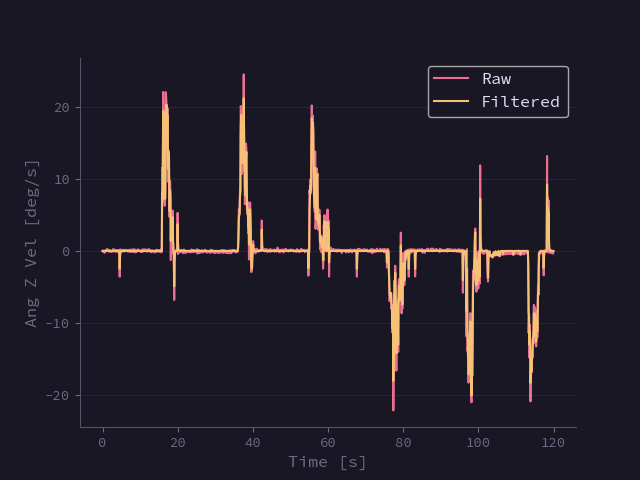
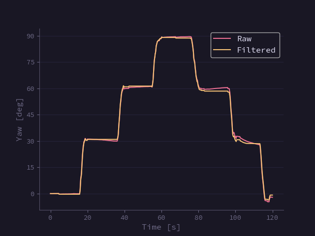

 **Note:** After testing, the device maintained a consistent reading within one degree at each angle as shown in the top right graph.